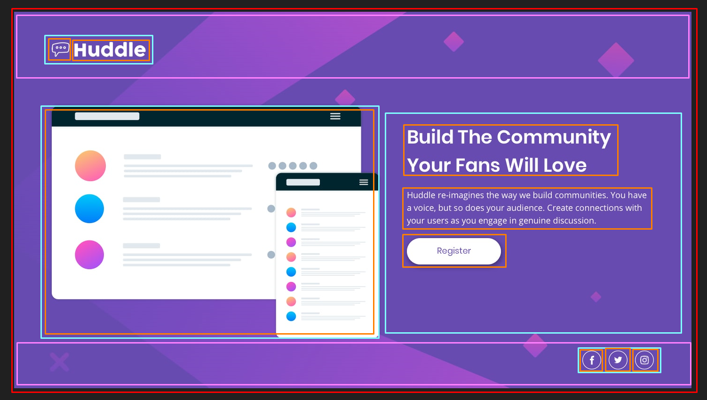

# Project - Huddle landing page
# PT-BR

Esse é um desafio proposto pelos gêmeos, Cadu e Beto, como uma quest do curso Dev em Dobro, feito com base no projeto do [Frontend Mentor](https://www.frontendmentor.io/home) de uma página landing de Huddle.

## tabela de conteúdos:

- [Visão geral](#visão-geral)
    - [O desafio](#o-desafio)
    - [Designs](#designs)
- [Meu processo](#meu-processo)
    - [Processo utilizado](#processo-utilizado)
    - [O que eu aprendi](#o-que-eu-aprendi)
    - [Dificuldades](#minhas-dificuldades)
- [Autor](#autor)

## Visão geral
### O desafio:
O desafio conciste na criação de uma página Huddle, nele os usuários devem ser capazes de:
- Ver o layout da página, dependo do tamanho da tela.
- Ver os estados de todos elementos interativos.

### Designs:
Versão desktop:

Versão Mobile:

## Meu Processo
### Processo utilizado:
1. Análise do projeto e design
    - Analisei o design do projeto para poder estudar onde colocar cada elemento e para ver quais elementos iria precisar.
    
2. Criação da base do projeto
    - Criar a estrutura de pastas e diretórios do projeto.
3. Começando a codar
    - Criei a estrutura base do HTML que iria usar e criei o reset.css e o variable.css com as principais variáveis.
4. Header
    - Após deixar tudo pronto para começar, com todas possíveis divisões que iria usar, começei a trabalhar no projeto começando pelo header. Coloquei todos elementos HTML e depois fui para o CSS para fazer todos ajustes.
5. Main
    - Partindo para o Main criei todos elementos pelo HTML separados por duas divs, para facilitar na estilização, uma para imagem e a outra para as informações; Após isso parti para o CSS utilizando do display grid para dividir em duas colunas e depois partindo para os ajustes geral.
6. Footer
    - Terminado o main eu parti direto para o footer, utilizando de uma nav e uma ul para fazer uma lista de redes, partindo para o CSS para estilizar utilizando de um display flex para alinhar ao final do container.
7. Ajustes
    - Fiz alguns ajustes para a página ficar melhor em monitores acima de 1440px.
8. Responsividade
    - Após ter o projeto rodando do jeito que queria em telas maiores, começei a fazer os ajustes para telas de tablet e mobile indo testando.
9. teste e ajustes finais
    - Fiz mais alguns testes e alguns ajustes finais para melhorar a responsividade.

### O que eu aprendi?

- Aprendi mais sobre como funciona o background.
- Aprendi sobre a importância de fazer testes no projeto.
- Aprendi que existem diversas formas de fazer a mesma coisa.

### Minhas dificuldades:

- Tive um pouco de dificuldade na hora de fazer os icons centralizandos com a borda redonda.
    - Resolvi utilizando um display flex para centralizar e dando uma altura e largura, no lugar de dar apenas um padding para o elemento.

- Tive um pouco de dificuldade na hora de usar o justify-content: space-between no body.
    - Resolvi trocando o display flex para um container-body, invés de aplicar direto no body.

## Autor

- Frontend Mentor - [@GFeltran](https://www.frontendmentor.io/profile/GFeltran)
- ~~Portfólio - [Feltran]()~~
- ~~Twitter - [@Feltran]()~~

# EN

This is a challenge proposed by the twins, Cadu and Beto, as a quest for the Dev em Dobro course, based on the [Frontend Mentor](https://www.frontendmentor.io/home) project of a Huddle landing page.

### table of contents:

- [Overview](#Overview)
    - [The challenge](#the-challenge)
    - [Designs](#designs)
- [My process](#my-process)
    - [Process used](#process-used)
    - [What I've Learned](#What-I-Learned)
    - [Difficulties](#my-difficulties)
- [Author](#author)

## Overview
### The challenge:
The challenge consists of creating a Huddle page, in which users must be able to:
- View page layout, depends on screen size.
- View the states of all interactive elements.

### Designs:
desktop version:

Mobile Version:

## My Process
### Process used:
1. Project analysis and design
    - I analyzed the design of the project in order to study where to place each element and to see which elements I would need.
    
2. Creation of the project base
    - Create the structure of folders and directories of the project.
3. Starting to code
    - I created the base structure of the HTML that I would use and created reset.css and variable.css with the main variables.
4. Header
    - After leaving everything ready to start, with all the possible divisions that I would use, I started working on the project starting with the header. I placed all the HTML elements and then went to the CSS to make all the adjustments.
    5. Main
    - Going to Main, I created all elements in HTML separated by two divs, to facilitate styling, one for the image and the other for the information; After that, I went to the CSS using the display grid to divide it into two columns and then leaving for the general adjustments.
6. footer
    - Once the main was finished, I went straight to the footer, using a nav and an ul to make a list of networks, leaving for the CSS to style using a flex display to align with the end of the container.
7. Adjustments
    - I made some adjustments for the page to look better on monitors above 1440px.
8. Responsiveness
    - After having the project running the way I wanted on larger screens, I started making adjustments for tablet and mobile screens by testing it.
9. final test and adjustments
    - I did some more tests and some final tweaks to improve responsiveness.

### What I've learned?

- I learned more about how the background works.
- I learned about the importance of testing in the project.
- I learned that there are several ways to do the same thing.

### My Difficulties:

- I had a little trouble making the icons centering with the round border.
    - I solved it using a flex display to center and giving a height and width, instead of just giving a padding to the element.

- I had a little trouble using justify-content: space-between in the body.
    - I solved it by changing the flex display to a container-body, instead of applying it directly to the body.

## Author

- Frontend Mentor - [@GFeltran](https://www.frontendmentor.io/profile/GFeltran)
- Linkedin - [Gabriel Feltran](https://www.linkedin.com/in/gabriel-feltran-137421271/)
- ~~Twitter - [@Feltran]()~~
